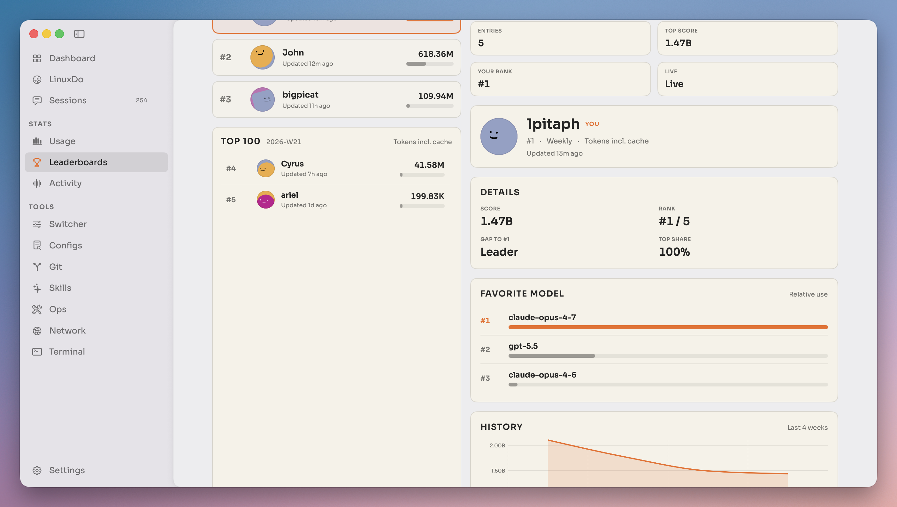
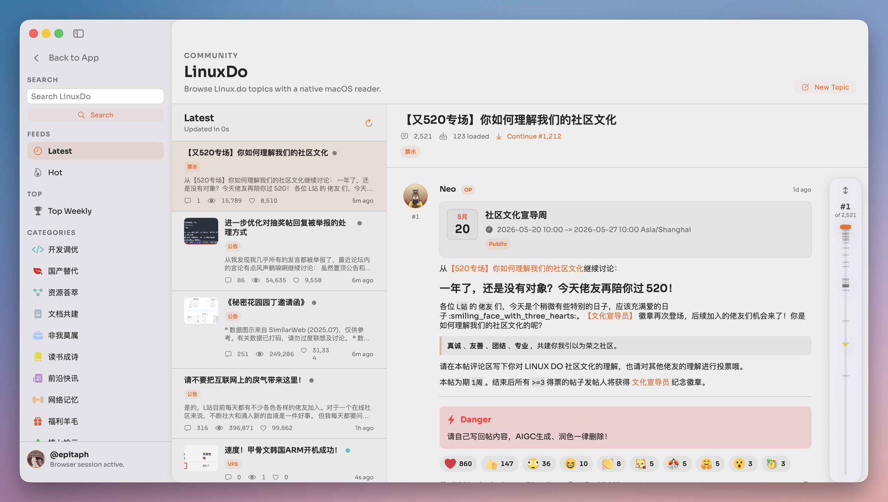
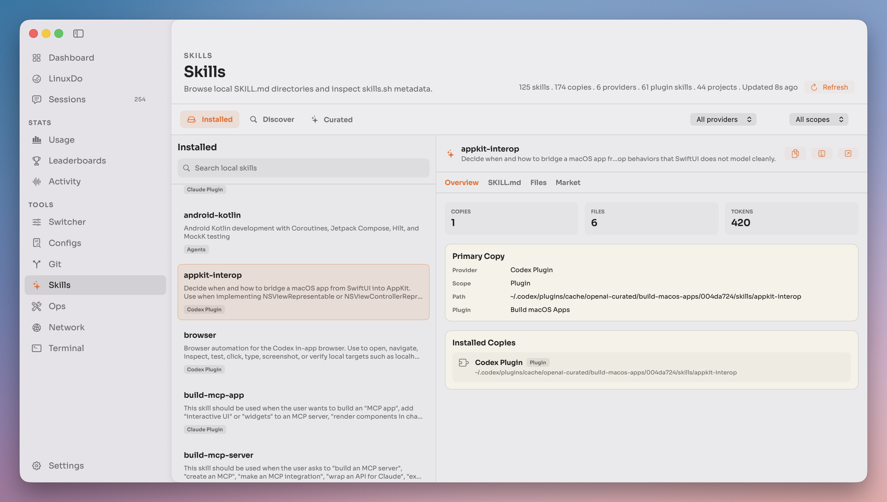
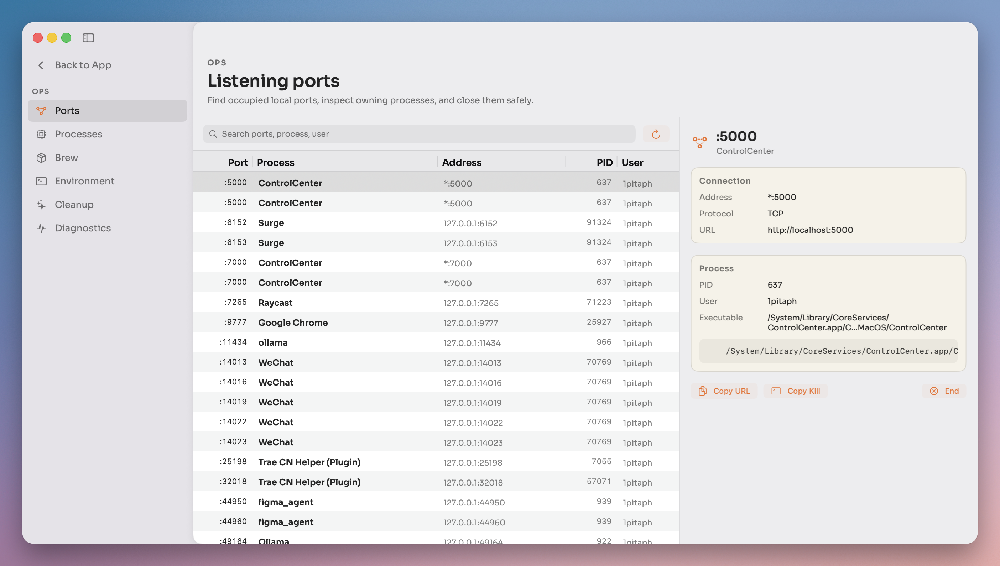
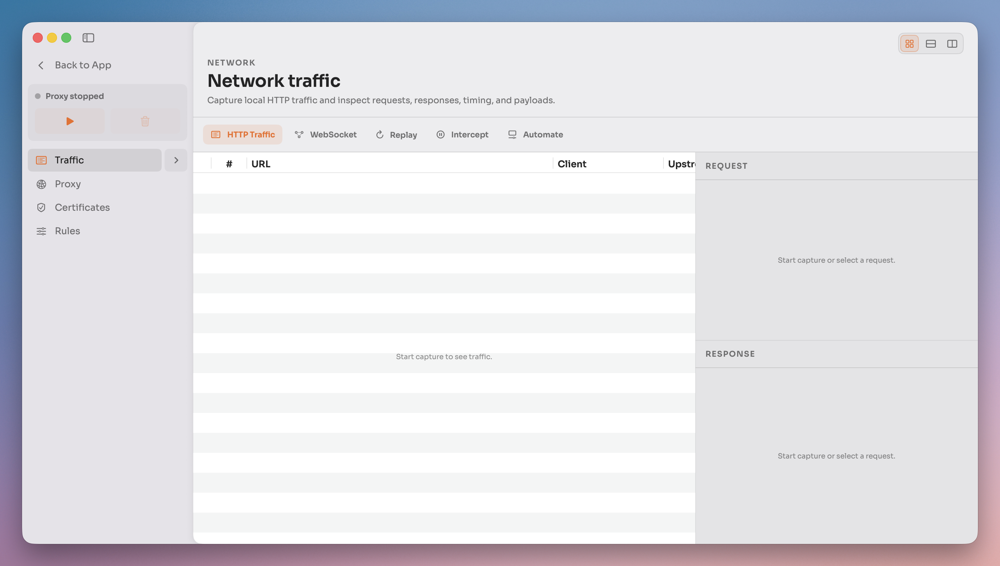
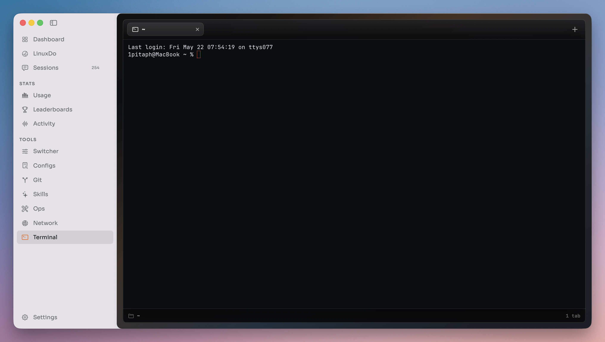
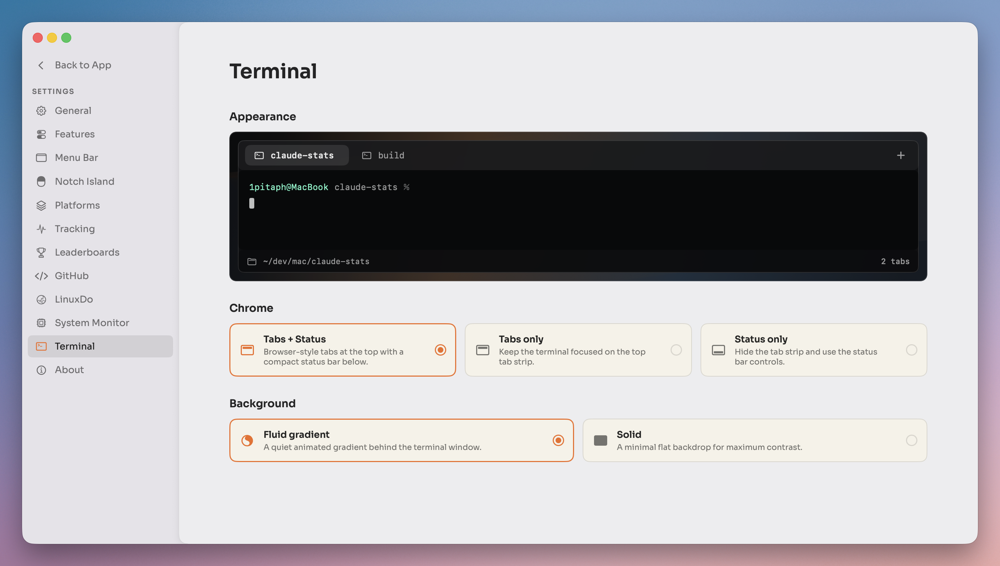

<p align="center">
  
</p>

<h1 align="center">Claude Stats</h1>

<p align="center">
  Native macOS menu-bar stats, terminal, Notch Island, and network debugging for AI coding work.
</p>

<p align="center">
  <a href="#features">Features</a> ·
  <a href="#screens">Screens</a> ·
  <a href="#install">Install</a> ·
  <a href="#build-from-source">Build From Source</a> ·
  <a href="#open-source--third-party-modules">Open Source</a> ·
  <a href="#contributing">Contributing</a>
</p>

Claude Stats is an open-source native macOS app for people who work in AI coding tools all day. It runs from the menu bar, reads local usage and activity data, and turns it into quick answers about sessions, tokens, cost, limits, repository activity, local status, and debugging context.

The app began as a focused macOS take on the open-source [Claude Statistics](https://github.com/sj719045032/claude-statistics) project. It now includes a multi-provider foundation, an embedded terminal, a Notch Island surface, and an integrated network debugger while keeping the main product name **Claude Stats**.

## Features

- Menu-bar usage stats for AI coding sessions, tokens, estimated cost, and recent activity.
- Provider support for [Claude Code](https://docs.anthropic.com/en/docs/claude-code) and OpenAI Codex session logs; Gemini, Kimi, and MiniMax are recognized in the UI while their on-disk session parsers are still future work.
- Usage-limit and service-status views for supported providers.
- Git and repository activity views, including optional bundled Git tooling for release builds.
- A Ghostty-powered embedded terminal.
- An Atoll-backed Notch Island surface for optional media, timer, stats, clipboard, terminal, and related modules.
- A Rockxy-backed network debugger with proxy, rule, certificate, and helper-tool integration.
- Sparkle-based automatic updates for packaged releases.

## Screens

Screenshots live in [`docs/assets/screens`](docs/assets/screens), grouped here by product area.

<details open>
<summary><strong>Stats and activity</strong></summary>

<p><strong>Dashboard overview</strong></p>


<p><strong>Sessions overview</strong></p>


<p><strong>Token usage and limits</strong></p>


<p><strong>AI-assisted focus timeline</strong></p>


<p><strong>Weekly leaderboards</strong></p>


</details>

<details>
<summary><strong>Community and local knowledge</strong></summary>

<p><strong>LinuxDo native reader</strong></p>


<p><strong>Plans and config browser</strong></p>


<p><strong>Skills library</strong></p>


</details>

<details>
<summary><strong>Developer tools</strong></summary>

<p><strong>API provider switcher</strong></p>


<p><strong>Repository workspace</strong></p>


</details>

<details>
<summary><strong>Ops, network, and terminal</strong></summary>

<p><strong>Listening ports</strong></p>


<p><strong>Homebrew packages</strong></p>


<p><strong>Developer environment check</strong></p>


<p><strong>Network traffic</strong></p>


<p><strong>Embedded terminal</strong></p>


</details>

<details>
<summary><strong>Settings</strong></summary>

<p><strong>Feature toggles</strong></p>


<p><strong>Terminal appearance</strong></p>


</details>

## Install

Packaged builds are published through the public release mirror:

- [GitHub Releases](https://github.com/1pitaph/claude-stats-releases/releases)
- [Sparkle appcast](https://1pitaph.github.io/claude-stats-releases/appcast.xml)

Release packaging supports both signed/notarized builds and unsigned fallback builds. If you use an unsigned build, macOS Gatekeeper may require opening it with right-click, then **Open**.

## Privacy & Data

Claude Stats is local-first. Core usage stats are read from local tool data such as `~/.claude/projects/` and `~/.codex/sessions/`; optional activity and desktop-limit features may request macOS permissions such as Full Disk Access, Accessibility, or Screen Recording.

Network-facing features are opt-in or feature-specific: Sparkle checks for updates, provider status views may query public status pages, Linux.do integration may authenticate through the browser, and the network debugger proxies only the traffic you route through it. The Rockxy helper and certificate features are powerful debugging tools, so review the source and settings before enabling HTTPS interception.

## Build From Source

Clone with submodules:

```bash
git clone --recursive https://github.com/1pitaph/claude-stats.git
cd claude-stats
```

Install local build tools:

```bash
brew install xcodegen
bash scripts/install-zig.sh  # installs the Zig version used to build GhosttyKit
```

Generate the Xcode project if you want to inspect it directly:

```bash
bash scripts/generate.sh
open ClaudeStats.xcodeproj
```

For normal development, prefer the helper scripts:

```bash
bash scripts/run-debug.sh  # generate + build Debug + launch the menu-bar app
bash scripts/run-tests.sh  # generate + build test dependencies + run unit tests
```

`ClaudeStats.xcodeproj` is generated from [`project.yml`](project.yml) with [XcodeGen](https://github.com/yonaskolb/XcodeGen). The debug launcher builds into the canonical `/tmp/Codex-stats-build` DerivedData path and launches the app by full path; this avoids Launch Services conflicts with menu-bar (`LSUIElement`) builds that share the same bundle identifier.

## Requirements

- macOS 14+
- Xcode 26+ with Swift 6 language mode
- XcodeGen for project generation
- Zig 0.15.2 for rebuilding `GhosttyKit.xcframework`

## Project Layout

```
ClaudeStats/
  App/          @main entry point, app environment, Info.plist, entitlements
  Features/     feature-specific app integrations such as Notch Island
  Models/       Sendable value types and generated release history
  Providers/    provider protocol, registry, and per-provider scanners/parsers
  Resources/    pricing data, Git tools placeholder, app resources
  Services/     stores, scanners, network debugging, system integrations
  ViewModels/   per-screen and feature view models
  Views/        menu bar, main window, settings, terminal, network, activity UI
  Utilities/    formatters, logging, shared helpers
AtollEmbed/       app-side wrapper for the Atoll/DynamicIsland integration
GhosttyEmbed/     app-side wrapper for embedded Ghostty terminal support
RockxyBackendEmbed/ app-side wrapper for Rockxy proxy/debugging support
ThirdParty/       git submodules for Atoll, Rockxy, and Ghostty
ClaudeStatsTests/ parser, scanner, settings, integration, and feature tests
docs/assets/      README images, icons, screenshots, and GIFs
scripts/          project generation, local run/test, release, appcast tooling
```

## Open Source & Third-Party Modules

Claude Stats is released under the [GNU Affero General Public License v3.0](LICENSE). The app also embeds and adapts several major open-source projects:

| Project | License | How Claude Stats uses it |
| --- | --- | --- |
| [Rockxy](https://github.com/1pitaph/Rockxy) | AGPL-3.0 | Integrated through `RockxyBackendEmbed` and `RockxyHelperTool` for the network debugger, proxy engine, rule handling, certificates, and privileged helper flow. |
| [Atoll / DynamicIsland](https://github.com/1pitaph/Atoll) | GPL-3.0 | Integrated through `AtollEmbed` for the optional Notch Island surface and modules. Its [`NOTICE`](ThirdParty/Atoll/NOTICE) and [`COPYRIGHT_ASSETS`](ThirdParty/Atoll/COPYRIGHT_ASSETS) files remain part of the attribution trail. |
| [Ghostty](https://github.com/ghostty-org/ghostty) | MIT | Integrated through `GhosttyEmbed` and `ThirdParty/ghostty/macos/GhosttyKit.xcframework` for the embedded terminal. Vendored Ghostty assets and dependencies retain their own licenses. |

Additional Swift Package Manager dependencies include Sparkle, SwiftNIO, SwiftNIOSSL, Swift Certificates, Swift Crypto, Defaults, KeyboardShortcuts, SwiftUIIntrospect, Lottie, MacroVisionKit, SkyLightWindow, AtollExtensionKit, Swift Collections, and SwiftSoup. Those packages keep their upstream licenses and notices.

## Contributing

Issues and pull requests are welcome. Before opening a PR, run:

```bash
bash scripts/run-tests.sh
```

For app behavior changes, also run:

```bash
bash scripts/run-debug.sh
```

Keep Swift 6 strict concurrency warning-free. When changing Atoll, Rockxy, or Ghostty integration code, make the source changes in the relevant submodule/fork first, then update the submodule pointer in this repo.
