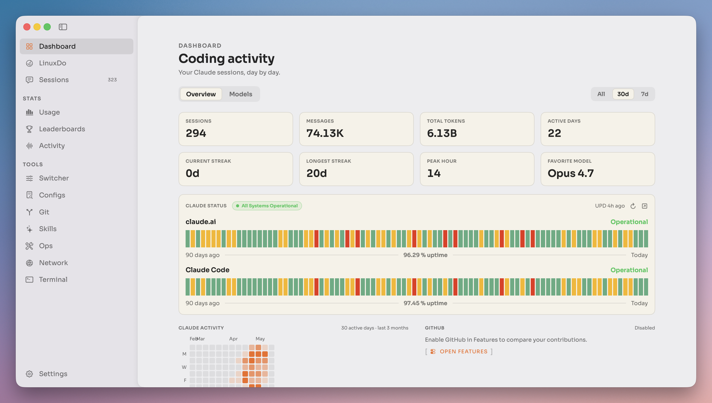
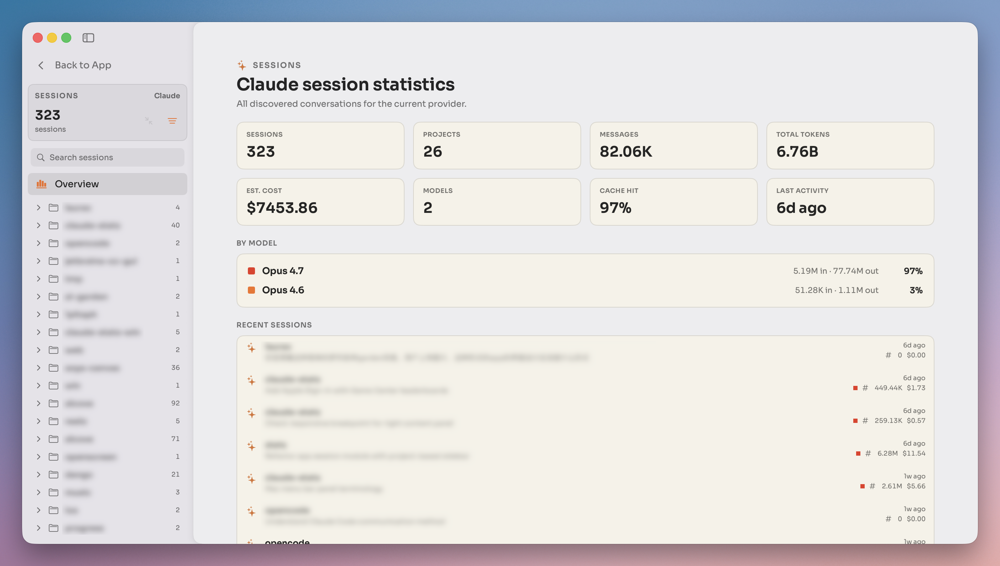
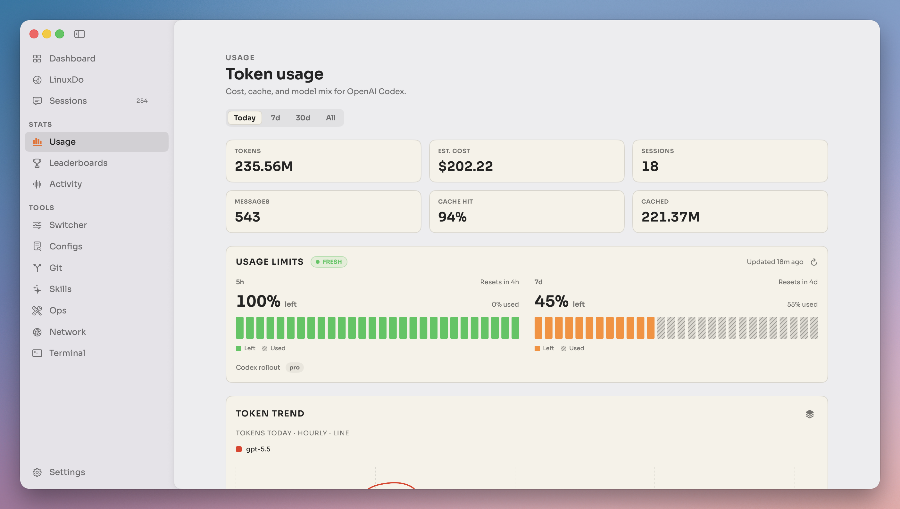
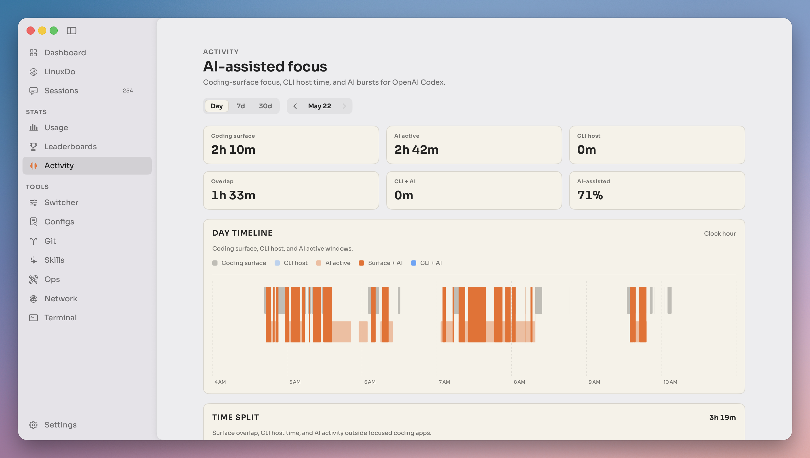
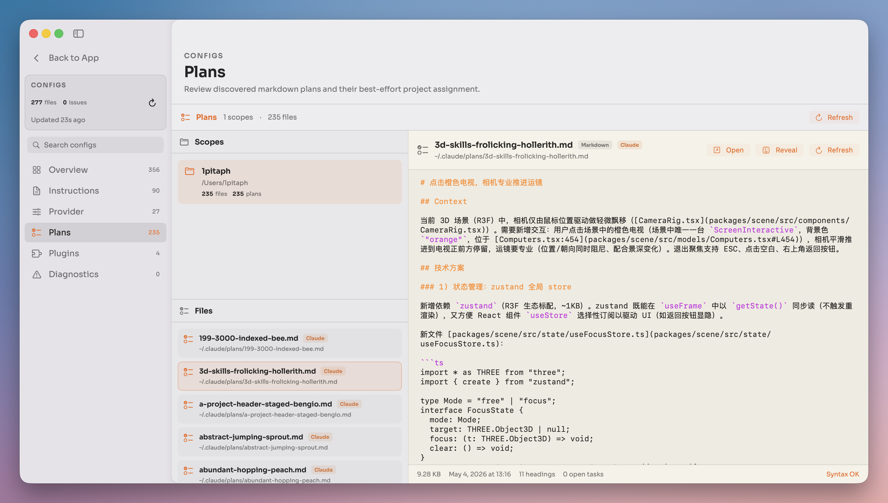
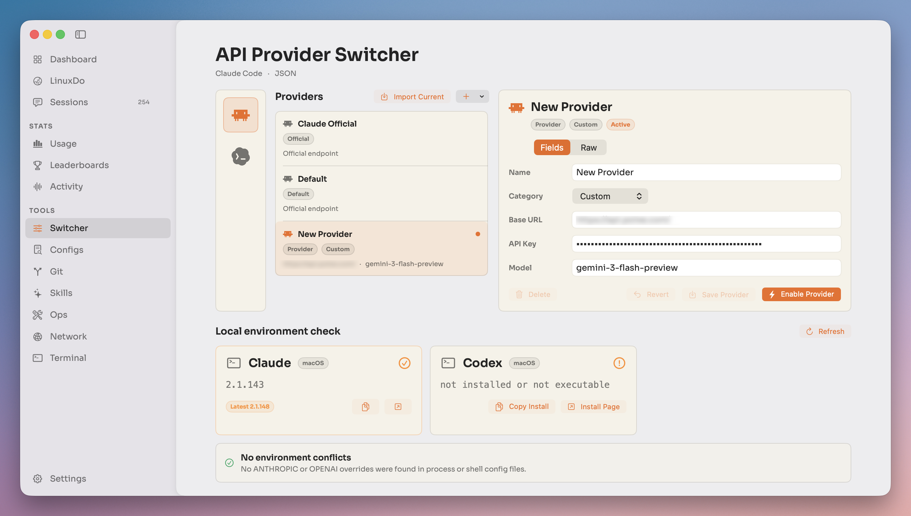
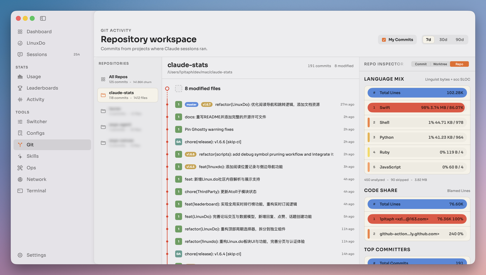
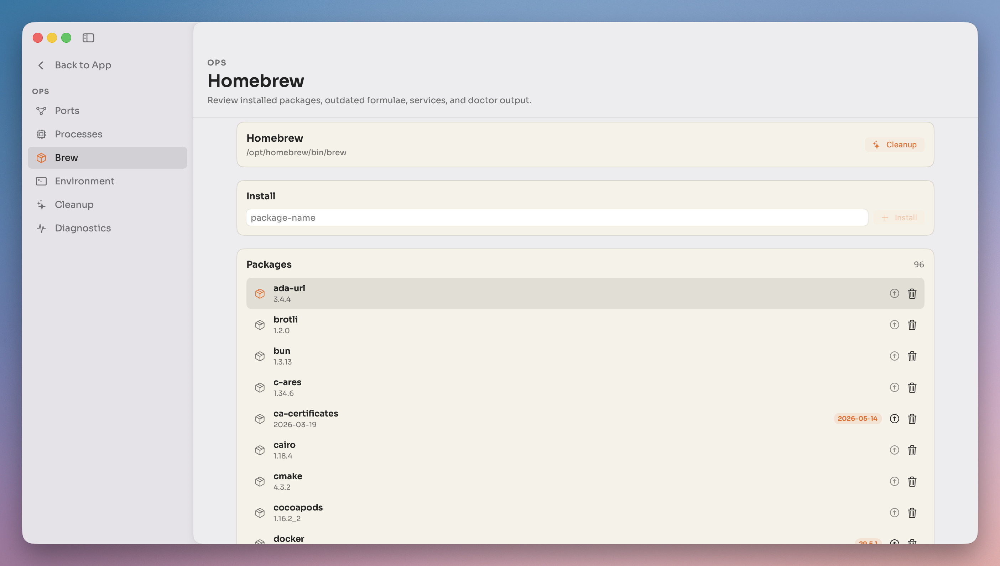
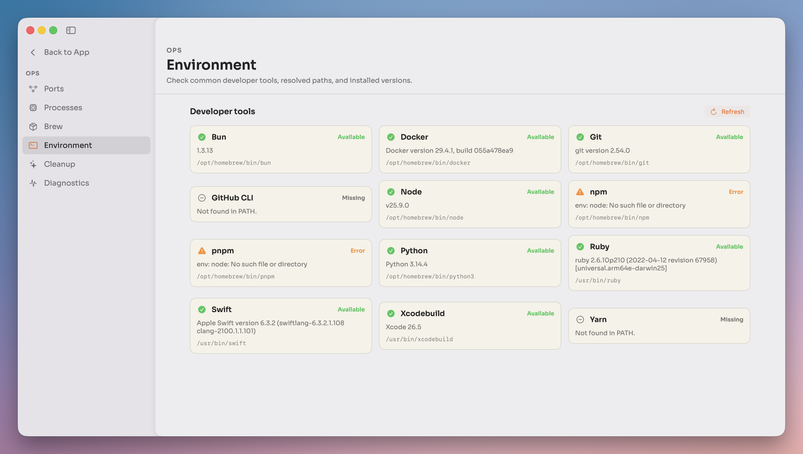
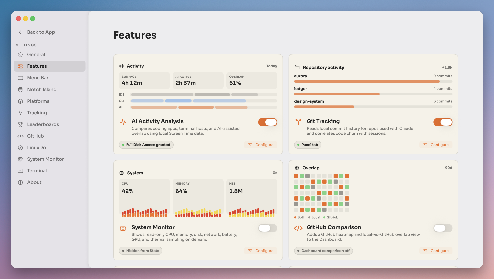

<p align="center">
  
</p>

<h1 align="center">Codex Statistics</h1>

<p align="center">
  Native macOS menu-bar statistics for OpenAI Codex coding work.
</p>

<p align="center">
  <a href="#features">Features</a> ·
  <a href="#screens">Screens</a> ·
  <a href="#install">Install</a> ·
  <a href="#build-from-source">Build From Source</a> ·
  <a href="#open-source--third-party-modules">Open Source</a> ·
  <a href="#contributing">Contributing</a>
</p>

Codex Statistics is an open-source native macOS app for people who work in OpenAI Codex all day. It runs from the menu bar, reads local Codex usage and activity data, and turns it into quick answers about sessions, requests, tokens, cost, limits, repository activity, local status, and debugging context.

The app began as a focused macOS take on the open-source [Claude Statistics](https://github.com/sj719045032/claude-statistics) project. It is now a Codex-only product with a provider abstraction kept internally for clean session, usage, and configuration boundaries.

## Reference Notes

- [Claude Statistics inspiration notes](docs/claude-statistics-inspiration-notes.md) collects product ideas worth reusing here, especially share cards, model pricing management, and transcript-based stats and cost analysis.
- [Codex Statistics product PRD](docs/claude-stats-product-prd.md) documents the current product by feature family for future refactors and second-development work.

## Features

- Menu-bar usage stats for AI coding sessions, tokens, estimated cost, and recent activity.
- Codex session log discovery, parsing, usage stats, estimated cost, usage limits, and OpenAI service status.
- API provider switcher for Codex CLI configuration.
- Git and repository activity views, including optional bundled Git tooling for release builds.
- Ops tools for Homebrew packages and developer environment checks.
- Sparkle-based automatic updates for packaged releases.

## Screens

Screenshots and GIF demos live in [`docs/assets/screens`](docs/assets/screens), grouped here by product area.

<details open>
<summary><strong>Menu-bar extra</strong></summary>

<table>
  <tr>
    <th align="left" width="33%">Usage panel</th>
    <th align="left" width="33%">Activity panel</th>
    <th align="left" width="33%">Git panel</th>
  </tr>
  <tr>
    <td valign="top" width="33%">
      
    </td>
    <td valign="top" width="33%">
      
    </td>
    <td valign="top" width="33%">
      
    </td>
  </tr>
</table>

<details>
<summary><strong>Share stats export</strong></summary>


</details>

</details>

<details open>
<summary><strong>Stats and activity</strong></summary>

<p><strong>Dashboard overview</strong></p>


<p><strong>Sessions overview</strong></p>


<p><strong>Token usage and limits</strong></p>


<p><strong>AI-assisted focus timeline</strong></p>


</details>

<details>
<summary><strong>Configuration and local knowledge</strong></summary>

<p><strong>Plans and config browser</strong></p>


</details>

<details>
<summary><strong>Developer tools</strong></summary>

<p><strong>API provider switcher</strong></p>


<p><strong>Repository workspace</strong></p>


</details>

<details>
<summary><strong>Ops</strong></summary>

<p><strong>Homebrew packages</strong></p>


<p><strong>Developer environment check</strong></p>


</details>

<details>
<summary><strong>Settings</strong></summary>

<p><strong>Feature toggles</strong></p>


</details>

## Install

Packaged builds are published from this repository:

- [GitHub Releases](https://github.com/CodeZen-Lizhi/claude-stats/releases)
- [Sparkle appcast](https://codezen-lizhi.github.io/claude-stats/appcast.xml)

Release packaging supports both signed/notarized builds and unsigned fallback builds. If you use an unsigned build, macOS Gatekeeper may require opening it with right-click, then **Open**.

### Compatibility

Current packaged releases support Apple Silicon Macs running macOS 15 or later. The app bundle still carries a macOS 14 deployment target for the main app shell, but packaged releases include runtime components whose practical floor is macOS 15.

Intel Macs are not supported by current releases. The last public universal build with both `x86_64` and `arm64` slices was [v1.3.9](https://github.com/1pitaph/claude-stats/releases/tag/v1.3.9); releases from v1.3.11 onward ship an `arm64` main executable.

## Privacy & Data

Codex Statistics is local-first. Core usage stats are read from local Codex data such as `~/.codex/sessions/`; optional activity features may request macOS permissions such as Full Disk Access, Accessibility, or Screen Recording.

Network-facing features are feature-specific: Sparkle checks for updates, OpenAI status views may query public status pages, and GitHub-related views connect only when configured.

## Build From Source

Clone with submodules:

```bash
git clone --recursive https://github.com/CodeZen-Lizhi/claude-stats.git
cd claude-stats
```

Install local build tools:

```bash
brew install xcodegen
```

Generate the Xcode project if you want to inspect it directly:

```bash
bash scripts/generate.sh
open ClaudeStats.xcodeproj
```

For normal development, prefer the helper scripts:

```bash
bash scripts/run-debug.sh  # generate + build Debug + launch the menu-bar app
bash scripts/run-tests.sh  # generate + build test dependencies + run unit tests
```

`ClaudeStats.xcodeproj` is generated from [`project.yml`](project.yml) with [XcodeGen](https://github.com/yonaskolb/XcodeGen). The debug launcher builds into the canonical `/tmp/Codex-stats-build` DerivedData path and launches the app by full path; this avoids Launch Services conflicts with menu-bar (`LSUIElement`) builds that share the same bundle identifier.

## Requirements

- Apple Silicon Mac with macOS 15+
- Xcode 26+ with Swift 6 language mode
- XcodeGen for project generation

## Project Layout

```
ClaudeStats/
  App/          @main entry point, app environment, Info.plist, entitlements
  Features/     feature-specific app integrations
  Models/       Sendable value types and generated release history
  Providers/    provider protocol, registry, and Codex scanner/parser
  Resources/    pricing data, Git tools placeholder, app resources
  Services/     stores, scanners, and system integrations
  ViewModels/   per-screen and feature view models
  Views/        menu bar, main window, settings, ops, and activity UI
  Utilities/    formatters, logging, shared helpers
ClaudeStatsTests/ parser, scanner, settings, integration, and feature tests
docs/assets/      README images, icons, screenshots, and GIFs
scripts/          project generation, local run/test, release, appcast tooling
```

## Open Source & Third-Party Modules

Codex Statistics is released under the [GNU Affero General Public License v3.0](LICENSE). Swift Package Manager dependencies are declared in [`project.yml`](project.yml); release builds currently embed Sparkle for automatic updates.

## Contributing

Issues and pull requests are welcome. Before opening a PR, run:

```bash
bash scripts/run-tests.sh
```

For app behavior changes, also run:

```bash
bash scripts/run-debug.sh
```

Keep Swift 6 strict concurrency warning-free.
